# Report of Create Rough dPLI Contrast Indexes 
This is the report for the milestone `create rough dpli contrast indexes`. You will find figures, results and general explanation on the codebase ( all the figures are in the hidden folder `.figure`).

## Why is the documentation here?
The documentation was in the wiki page of Github, I (yacine mahdid) decided to switch to an in-code documentation for two reasons:
1. To not be tied to Github for documenting and reporting
2. To be able to version control the documentation page

I'm open to other suggestions to document the code and the analysis, however due to the highly changing nature of the analysis it is difficult to keep the documentation up-to-date the further away from the code it lies.

## Table of Content
- [Code Structure](#code-structure)
- [dPLI per Participant](#dpli-per-participant)
- [dPLI Dynamic Reconfiguration Index](#dpli-dynamic-reconfiguration-index)
  - [Attempt #1](#attempt-1)
  - [Attempt #2](#attempt-2)
  - [Attempt #3](#attempt-3)
  - [Attempt #4 (Current Version)](#attempt-4)
- [Meeting 1 Notes](#meeting-1-notes)

## Code Structure
The codebase is structured in experiments where each one is directly tied to one of the issues on our task management system (here it is Github kanban functionality). The nomenclature you will find is `ex_XX` where XX means is a digit that maps to the issue number on this repository. If you see an experiment with a given number missing, it might be due by the fact that the given issue was not directly tied to code in the repository. For instance it could have been a documentation task or a reporting task which didn't require any sort of scripting.

## dPLI per Participant
This is the dPLI matrices that were generate using the code at `ex_10e_validate_dpli_matrices_with_bp.mat`. This particular script allows us to analyze the Brain Product headset as well as the Electrical Geodesic one. It make uses of a KNN-based algorithm to map the two electrodes position to have a similar nomenclature. This allows us to reorder easily the connectivity matrices in the `FTCPO` format (frontal, temporal, central, parietal and occipital). 

We have three states:
- baseline
- anesthesia
- recovery

The matrix are normalized within subject with mean() +- 3*std. This was done since normalizing the color map with the real min/max was giving mostly green matrices for baseline and recovery. 

**WSAS17 is currently excluded since it doesn't have a recovery.**

### WSAS02
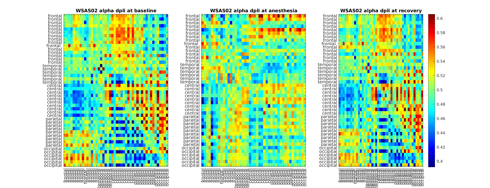

### WSAS05
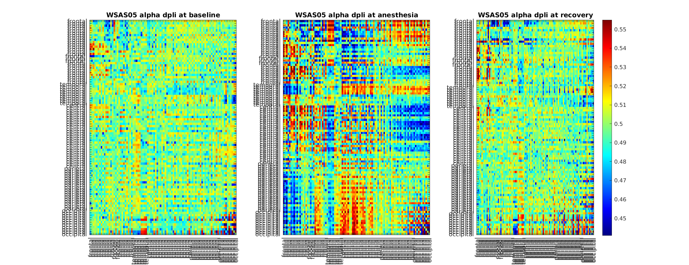

### WSAS09
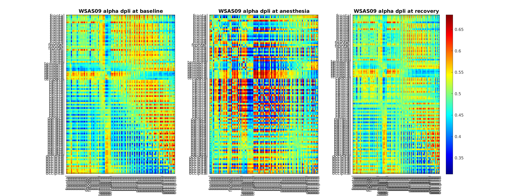

### WSAS10
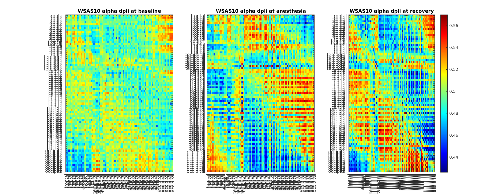

### WSAS11
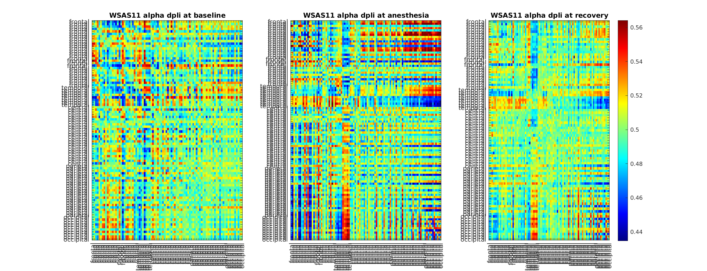

### WSAS12
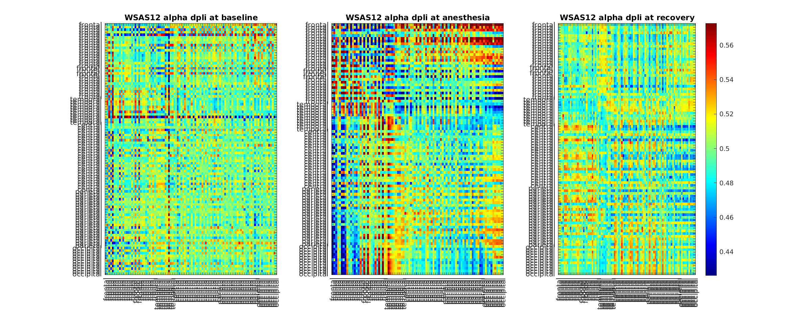

### WSAS13
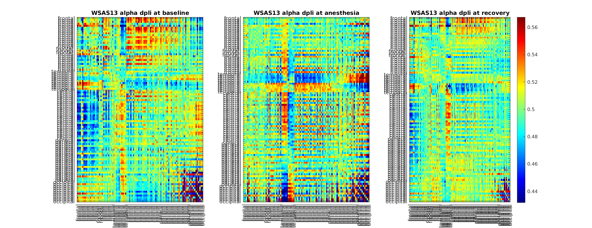

### WSAS18
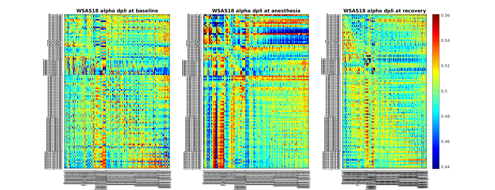

### WSAS19
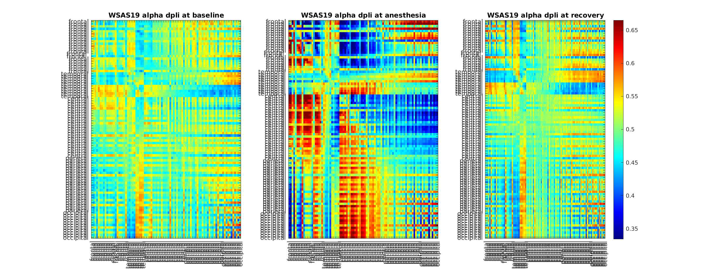

### WSAS20
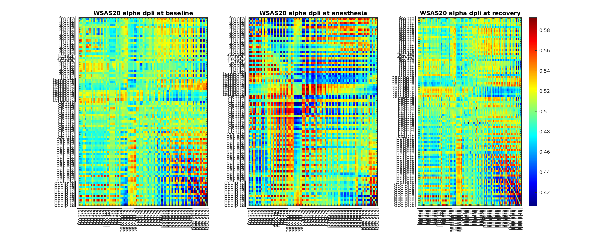

### WSAS22
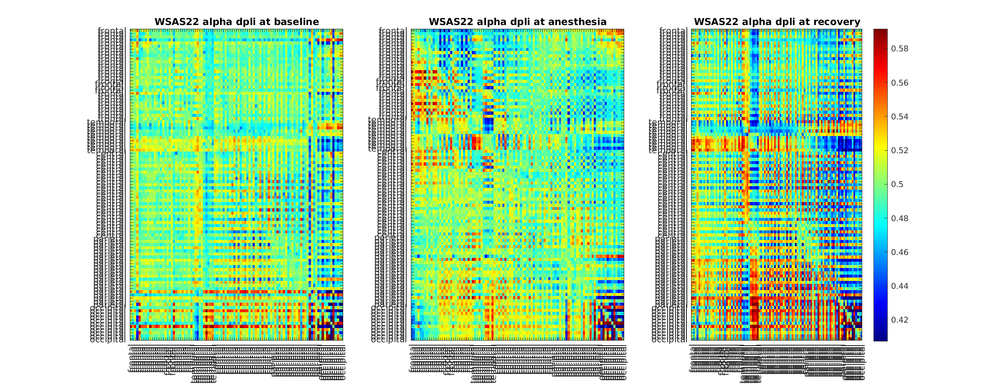

## dPLI Dynamic Reconfiguration Index
Here is where I document all of our incremental attempt in making the dpli-dri.

### Attempt 1

### Attempt 2

### Attempt 3

### Attempt 4
**This is the current version**

## Meeting 1 Notes
Two features seems to be important, hub location and dPLI. However, hub location as it currently stands is very experimental and has conceptual problems. The dPLI feature is stable however.
For the dPLI we want to do similarity/difference matrix
- Baseline vs Recovery similarity matrix
- Baseline vs Anesthesia difference matrix
- Recovery vs Anesthesia difference matrix

These difference matrix will tell us if our intuition is correct and will help out in developing a metric. One thing to keep in mind is that for the visual we should be using the full matrix, however half of the matrix is fully redundant. **Keeping only the top or the bottom triangle will help reduce the dimensionality**.

There was something about cosine similarity of alpha hubs and something about k-mean clustering with 2 clusters and training a classifier on these clusters.

**Should really take more notes or record such meeting since we lost a lot of information**
